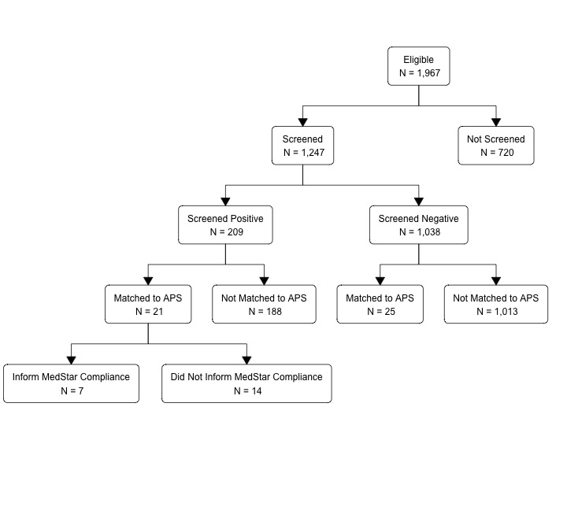
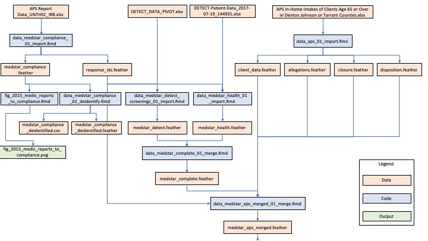
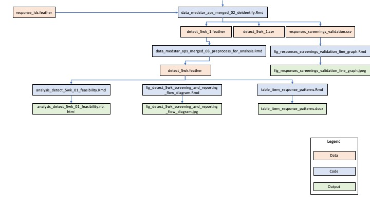

 Detection of Elder abuse Through Emergency Care Technicians (DETECT) by Brad Cannell is licensed under a <a rel="license" href="http://creativecommons.org/licenses/by-nc-nd/4.0/">Creative Commons Attribution-NonCommercial-NoDerivatives 4.0 International License</a>.

# Detection of Elder Abuse Through Emergency Care Technicians (DETECT) 5-Week Pilot Study

# Background about the DETECT project

In collaboration with [Texas Adult Protective Services (APS)](https://www.dfps.state.tx.us/Adult_Protection/) and one of the largest mobile healthcare providers in North Texas — [MedStar Mobile Healthcare (MedStar)](http://www.medstar911.org/) — our team developed and piloted an EA screening tool: Detection of Elder Abuse Through Emergency Care Technicians (DETECT). The DETECT tool was designed specifically to help medics identify potential EA among community-dwelling older adults during an emergency response. DETECT relies entirely on the medics’ systematic observations of the older adults’ physical and social environment — no direct questioning of the older adult or their caregivers is involved. The intent was to create an EA screening tool that was easy for medics to use in the field and that helped medics capture information about older adults, their environments, and their caregivers that is thought to be associated with the occurrence of EA. 

We pilot tested using the DETECT screening tool with medics in the field between September 17th and October 26th, 2015. During the pilot test, MedStar’s Electronic Patient Care Reporting system (ePCR) was programmed to automatically prompt all medics to complete an EA screening using the DETECT tool while on an eligible 911 response. An eligible 911 response was defined as a call for a community-dwelling patient who was 65 years of age or older, the setting was the patient’s residence, and the patient resided in the community (e.g., private home, unlicensed adult foster homes, unlicensed board and care homes, etc.). Other types of residences (e.g., licensed skilled nursing facilities) were excluded because reports of EA in these settings are generally not investigated by APS in Texas. By definition, older adults who participated in the pilot study had to live in MedStar’s service area of an estimated (978,000 residents), which included Fort Worth, Texas, and 14 surrounding communities.

This repository contains all the data analysis code our team used to evaluate the DETECT 5-week pilot study. Or findings are published in the [Journal of Elder Abuse and Neglect](https://www.tandfonline.com/loi/wean20).

# DETECT pilot data

Deidentified data collected during the DETECT pilot study are available from [NACJD](https://www.icpsr.umich.edu/icpsrweb/content/NACJD/index.html).

[Codebook for the deidentified DETECT 5-week pilot study data](https://www.dropbox.com/s/vmruaeayiig4usu/codebook_detect_5wk.docx?dl=0)

## Figure 1. A flow diagram illustrating the DETECT pilot study screening and reporting procedures.

## Figure 2. A flow diagram illustrating which data sources were used for each analysis.

# Data cleaning and analysis codes

You can use the file tree near the top of the page to view and/or download any of the programming code we used to manage and analyze data for this project. Additionally, the links below will take you directly to the code we used to generate the results that we believe will be of greatest interest to many people viewing this repository.

[Figure 3. Qualified responses and completed screenings over the duration of the DETECT pilot study (9-17-2015 to 10-26-2015)](https://www.dropbox.com/s/h9zl71ry1l57eh8/fig_responses_screenings_validation_line_graph.nb.html?dl=0)

[Analyses related to procedural feasibility](https://www.dropbox.com/s/ueuicrqfml2kder/analysis_detect_5wk_01_feasibility.nb.html?dl=0)

[Table 1. Response patterns for each of the 26 DETECT screening item.](https://github.com/brad-cannell/detect_pilot_test_5w/blob/master/markdown/table_item_response_patterns.Rmd)

[Figure 4. Medic reports to APS that MedStar’s legal compliance department was made aware of, by month, 2015 (n = 49)](https://www.dropbox.com/s/2ciev5f7yzxjiex/fig_2015_medic_reports_to_compliance.nb.html?dl=0)

[Change in EA Reporting Frequency](https://github.com/brad-cannell/detect_pilot_test_5w/blob/master/sas/DETECT_code_for_Change_in_Reporting.sas)

# APS Handbook

For details about the APS outcome variables (e.g., allegations, dispositions, etc.) please refer to the [APS Handbook](http://www.dfps.state.tx.us/handbooks/APS/).

# Funding Acknowledgement

This project was supported by Award No. 2014-MU-CX-0102, awarded by the National Institute of Justice, Office of Justice Programs, U.S. Department of Justice. The opinions, findings, and conclusions or recommendations expressed in this publication/ program/exhibition are those of the author(s) and do not necessarily reflect those of the Department of Justice.
